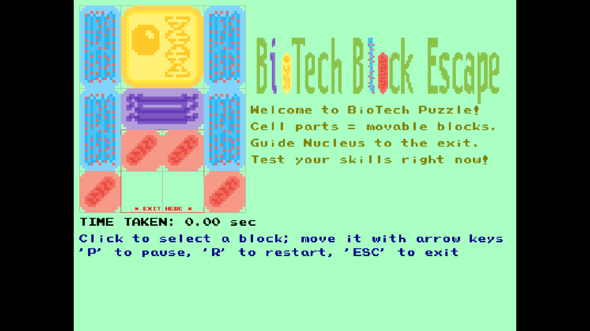
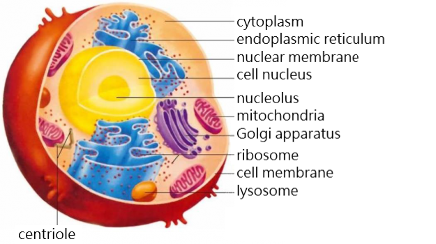

# BioTech Block Escape - A Unique Remake of the Classic Klotski Puzzle  

  

## Description  
This project is a dedicated remake of the classic Klotski puzzle game, featuring graphics inspired by cellular structures, including the Nucleus, Endoplasmic Reticulum (ER), Golgi Apparatus, and Mitochondria. Built with [@DualBrain](https://github.com/DualBrain)'s `vbPixelGameEngine`, the goal is to navigate the Nucleus to the exit at the bottom of the board.

The visuals draw from a cellular diagram in the biology textbook from my high school, all hand-crafted by me using Aseprite (a popular pixel art tool). As with traditional Klotski, one of the biggest challenges is maneuvering the large square beneath the horizontal bar before it could reach the exit. This mirrors the unexpected hurdles in biotech labs, not to mention the struggles of postgraduate life.

Postgraduate burnout is a growing concern in our community. Today's graduate students often face endless lab failures and/or harsh criticism from advisors, which is why I merged biotech lab themes with Klotski: to create a small source of relaxation for those going through similar struggles.

## Graphics Design
- 2x2 Large Square: Nucleus
- 1x2 Vertical Bar: Endoplasmic Reticulum
- 2x1 Horizontal Bar: Golgi Apparatus
- 1x1 Small Square: Mitochondria

These designs are based on diagrams from the high school biology textbook. The original Chinese annotations were translated to English with the help of online tools, to align with this project's documentation.



## Prerequisites
- [.NET SDK](https://dotnet.microsoft.com/download): version 8.0 or later  
- IDE: Visual Studio 2022 or Visual Studio Code
- [**vbPixelGameEngine**](https://github.com/DualBrain/vbPixelGameEngine)
  - Clone the source code of the engine and build it with `dotnet build`.
  - To write a new VB.NET game, just reference the engine's DLL in your project.
- Required NuGet Package: **System.Drawing.Common 9.0.0+**

## How to Play  
1. Clone the repository and navigate to the project directory:  
  ```bash  
  git clone https://github.com/Pac-Dessert1436/BioTech-Block-Escape.git
  cd BioTech-Block-Escape  
  ```  
2. Restore dependencies with `dotnet restore`.  
3. Run the game: use `dotnet run` in VS Code, or click "Run" in Visual Studio 2022.  
4. Controls: Click to select a block, then use arrow keys to move it.
5. Hotkeys: Press 'P' to pause, 'R' to restart, or 'ESC' to exit.

## Personal Notes  
Creating this game has been a meaningful journey. Though I graduated college, I found myself drawn back to programming, even after vowing to focus on this year's Postgraduate Entrance Exam in my hometown. Failing last year's exam (when I aimed for "Biology and Medicine") made me doubt my ability to pursue bioinformatics, and I've gradually forgotten much of my biology knowledge.  

I've since switched to studying Chinese Materia Medica, which, like General Biology, requires heavy memorization. I even built a private VB.NET WinForms app to quiz myself on herbal medicine properties (stored in a YAML file) - though I won't upload it to GitHub.

Thankfully, I'm not alone in life's struggles. These months I've watched classmates fight their own battles, whether they're in grad school or starting careers. Like Klotski, we all face our own "horizontal bars." Staying stuck isn't an option; we must push through to find our way forward.

In the end, this ~300-line VB.NET game is more than a tribute to my lingering passion for bioinformatics. It's a reflection on the stress of navigating adulthood. Life goes on, and I have no choice but to keep courage for my exam preparation, though I still cherish these small coding moments as a form of self-care.

## License  
This project is licensed under the MIT License. See the [LICENSE](LICENSE) file for details.  